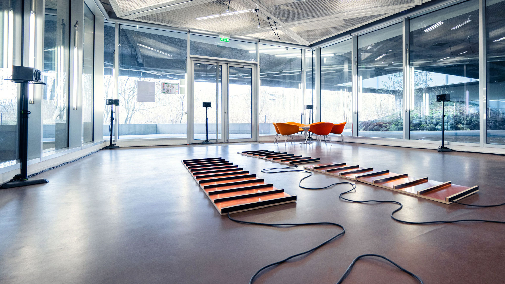
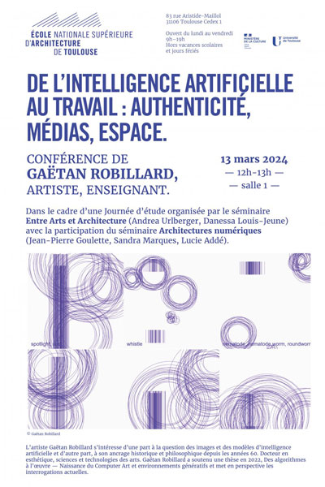

<!-- keywords: Gaëtan Robillard, de Robillard, art, research, software, teaching, exhibition, recherche, logiciel, enseignement, exposition, s+t+arts prize, le fresnoy, inrev, crilcq, université gustave eiffel, des algorithmes à l'oeuvre, computer art, environnements génératifs, apprentissage profond, intelligence artificielle, algorithms at work, generative environments, deep learning, artificial intelligence -->

    <a href="https://github.com/robillardstudio" target="_blank">GitHub</a> 
    <a href="https://www.zotero.org/gaetanrobillard" target="_blank">Zotero</a> 
    <a href="https://linkedin.com/in/gaetanrobillard" target="_blank">LinkedIn</a>

gaëtan robillard. art, design, research, software.

Critical Climate Machine, Copper, wood, electronics, X (Twitter) data collection and classification software, eight-channel sound installation, 30–40 inch screen, variable dimensions, 2021-2024. Exibition view at Gustave Eiffel University (solo exhibition), in the back : table and chairs for playing the Refutation Game, 2024. Photographer : Gabriel de La Chapelle.

-----------------

**recent**

<!--  -->

Gaëtan Robillard, « De l'intelligence artificielle au travail : Authenticité, médias, espace », École Nationale Supèrieure d'Architecture de Toulouse, 2024. 

Gaëtan Robillard, [Modèles d’intelligence artificielle et régimes d’authenticité : dossier thématique](https://edisem.arcanes.ca/omk/s/miara), Groupe international de recherche Arcanes, 2023.

-----------------

**generative environments and more**

[Critical Climate Machine (CCM), 2021-2024](ccm.md)  
[The Refutation Game, 2021](rg.md)  
[Climategate: 1073 emails hacked from the Climate Research Unit institute (UK), 2020](img/gaetan-robillard-climate-gate-2020.jpg)  
[The Wave in the Matrix, 2019](img/gaetan-robillard-the-wave-in-the-matrix-2019.jpg)  
[The Material Basis, 2019](img/gaetan-robillard-the-material-basis-2019.jpg)  
[Logical Drawings, 2019](img/gaetan-robillard-logical-drawings-2019.jpg)  
Vera Molnar Machine Visuelle (VMMV), 2018  
Cellular Automata (wall drawing), 2018  
Generic Images (index, generate, learn), 2016  
Undoing the Tide, 2015  
[Searching for the Wave, 2013](img/gaetan-robillard-en-recherchant-la-vague-palais-de-tokyo-2015.jpg)  
Monsieur Tas, 2013  
Citypods, 2007  
Trestles, 2005

-----------------

**publications (selection)**

Gaëtan Robillard (editor), *Conversations about Computer Art and Artificial Intelligence* (upcoming), ESAD TALM-Tours, 2023.

Gaëtan Robillard, "Max Bense en visionnaire : De l’entropie à la dialectique des images programmées", Images Re-vues [En ligne], Hors-série, 2021.

Gaëtan Robillard, "Critical Climate Machine: Data, AI and Sound", MediaFutures blog, 2021.

Gaëtan Robillard and Alain Lioret, "A Vision without a Sight: From Max Bense’s Theory to the Dialectic of Programmed Images" (proceedings), XXI Generative Art, Domus Argenia, Rome, 2019.

Gaëtan Robillard and Thierry Mouillé, *Workshop IA / Paperwork: Espace haute fréquence*, LDI et ESAD TALM-Tours, 2019.

-----------------

[summary](summary.md)

<!-- **softwares (selection)**

[Critical Climate Machine, Python, Intelligent Museum Residency, ZKM/Hertz-Lab, 2022.](https://git.zkm.de/Hertz-Lab/Research/intelligent-museum/residencies/gaetan-robillard/critical-climate-machine)

[PaperWork, JavaScript, IMAC engineer program, Université Gustave Eiffel, 2019.](https://github.com/robillardstudio/Paperwork)

[Generic Images, C++, IMAC engineer program, Université Gustave Eiffel, 2017.](https://github.com/robillardstudio/Images-Generiques) -->

