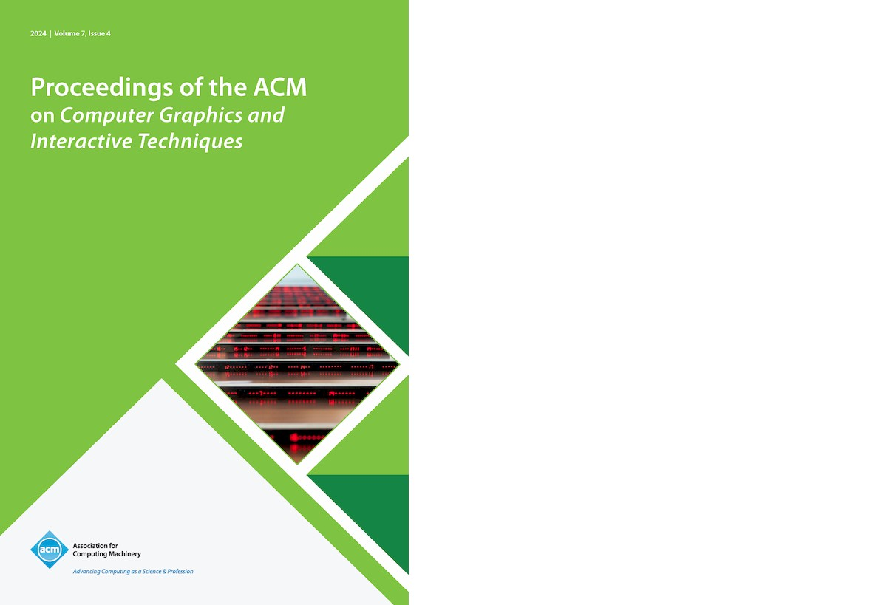

<!-- keywords: Gaëtan Robillard, de Robillard, art, research, software, teaching, exhibition, recherche, logiciel, enseignement, exposition, s+t+arts prize, le fresnoy, inrev, crilcq, université gustave eiffel, des algorithmes à l'oeuvre, computer art, environnements génératifs, apprentissage profond, intelligence artificielle, algorithms at work, generative environments, deep learning, artificial intelligence -->

    <a href="https://linkedin.com/in/gaetanrobillard" target="_blank">linkedin</a> 
    <a href="https://github.com/robillardstudio" target="_blank">github</a> 
    <a href="https://www.zotero.org/gaetanrobillard" target="_blank">zotero</a>

gaëtan robillard. art, design, research, software.

*Three Lines (in Latent Space)*, series of images produced with generative adversarial network, trained on custom synthetic data, 2023.

-----------------

**recent**

On 7th of November 2024, at Cité du design and Esadse Saint-Etienne: launch of the 58th issue of Azimuts journal,  dedicated to AI and featuring a short paper on *Three Lines*. See [url](https://www.citedudesign.com/fr/a/lancement-azimuts-design-art-recherche-n58-3361).

CCM received "Best Art Paper Award" at SIGGRAPH 2024, Denver USA. [Download PDF](medias/Robillard_&_Nika_CCM_SIGGRAPH_2024.pdf).

CCM now appears on the cover of the new issue of the academic journal *Intermediality: History and Theory of the Arts, Literature and Technologies* (No. 42). This issue includes a new article about the Refutation Game. See [url](http://intermedialites.com/nouvelle-parution-no-42-tromper-deceiving).

-----------------

**generative environments**

[Critical Climate Machine (CCM), 2021-2024](ccm.md)  
[The Refutation Game, 2021](rg.md)  
[Logical Drawings, 2019](l-drawings.md)  
[More (2005-2024)...](gen-env.md)

-----------------

**publications (selection)**

<!-- Gaëtan Robillard (editor), *Conversations about Computer Art and Artificial Intelligence* (upcoming), 2024. -->

Gaëtan Robillard and Jérôme Nika, "Critical Climate Machine: A Visual and Musical Exploration of Climate Misinformation through Machine Learning", *Proc. ACM Comput. Graph. Interact. Tech.*, 2024. [https://doi.org/10.1145/3664215](https://doi.org/10.1145/3664215)

Gaëtan Robillard, "Le Jeu de la réfutation. (Re)médiation du climat à travers un environnement génératif", *Intermédialités : histoire et théorie des arts, des lettres et des techniques*, 2024. [https://doi.org/10.7202/1109853ar](https://doi.org/10.7202/1109853ar)

Gaëtan Robillard, "Modèles d’intelligence artificielle et régimes d’authenticité : dossier thématique", Groupe international de recherche Arcanes, 2023. see [url](https://edisem.arcanes.ca/omk/s/miara).

Gaëtan Robillard, "Max Bense en visionnaire : De l’entropie à la dialectique des images programmées", Images Re-vues, Hors-série, 2021. [https://doi.org/10.4000/imagesrevues.10395](https://journals.openedition.org/imagesrevues/10395)

-----------------

[summary](summary.md)

<!-- **softwares (selection)**

[Critical Climate Machine, Python, Intelligent Museum Residency, ZKM/Hertz-Lab, 2022.](https://git.zkm.de/Hertz-Lab/Research/intelligent-museum/residencies/gaetan-robillard/critical-climate-machine)

[PaperWork, JavaScript, IMAC engineer program, Université Gustave Eiffel, 2019.](https://github.com/robillardstudio/Paperwork)

[Generic Images, C++, IMAC engineer program, Université Gustave Eiffel, 2017.](https://github.com/robillardstudio/Images-Generiques) -->

