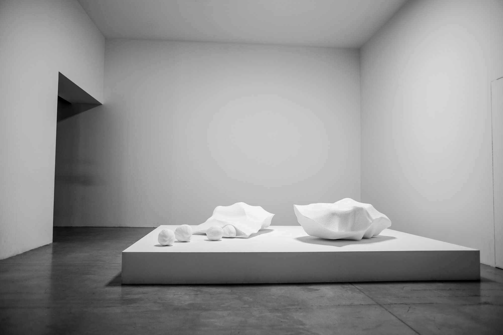

<!-- keywords: Gaëtan Robillard, de Robillard, art, research, software, teaching, exhibition, recherche, logiciel, enseignement, exposition, s+t+arts prize, le fresnoy, inrev, crilcq, université gustave eiffel, des algorithmes à l'oeuvre, computer art, environnements génératifs, apprentissage profond, intelligence artificielle, algorithms at work, generative environments, deep learning, artificial intelligence -->

gaëtan robillard. art, research, software, teaching.

*Searching for the Wave (En recherchant la vague)*, audiovisual installation including CNC milling on styrofoam, 2013. Exhibition view at Palais de Tokyo (Le Rêve des formes), 2015.

-----------------

**generative environments and more**

[Critical Climate Machine (CCM), 2021-](ccm.md)  
[The Refutation Game, 2021](rg.md)  
Climategate : 1073 emails hacked from the Climate Research Unit institute (UK), 2020  
The Wave in the Matrix, 2019  
The Material Basis, 2019  
Logical Drawings, 2019  
Vera Molnar Machine Visuelle (VMMV), 2018  
Cellular Automata (wall drawing), 2018  
Generic Images (index, generate, learn), 2016  
Undoing the Tide, 2015  
Searching for the Wave, 2013  
Monsieur Tas, 2013  
Citypods, 2007  
Trestles, 2005

-----------------

**publications (selection)**

Gaëtan Robillard (editor), *Conversations about Computer Art and Artificial Intelligence* (book in progress), ESAD TALM-Tours, 2023.

Gaëtan Robillard, "Max Bense en visionnaire : De l’entropie à la dialectique des images programmées", Images Re-vues [En ligne], Hors-série, 2021.

Gaëtan Robillard, "Critical Climate Machine: Data, AI and Sound", MediaFutures blog, 2021.

Gaëtan Robillard and Alain Lioret, "A Vision without a Sight: From Max Bense’s Theory to the Dialectic of Programmed Images" (proceedings), XXI Generative Art, Domus Argenia, Rome, 2019.

Gaëtan Robillard and Thierry Mouillé, *Workshop IA / Paperwork: Espace haute fréquence*, LDI et ESAD TALM-Tours, 2019.

-----------------

[summary](summary.md)

<!-- **softwares (selection)**

[Critical Climate Machine, Python, Intelligent Museum Residency, ZKM/Hertz-Lab, 2022.](https://git.zkm.de/Hertz-Lab/Research/intelligent-museum/residencies/gaetan-robillard/critical-climate-machine)

[PaperWork, JavaScript, IMAC engineer program, Université Gustave Eiffel, 2019.](https://github.com/robillardstudio/Paperwork)

[Generic Images, C++, IMAC engineer program, Université Gustave Eiffel, 2017.](https://github.com/robillardstudio/Images-Generiques) -->

