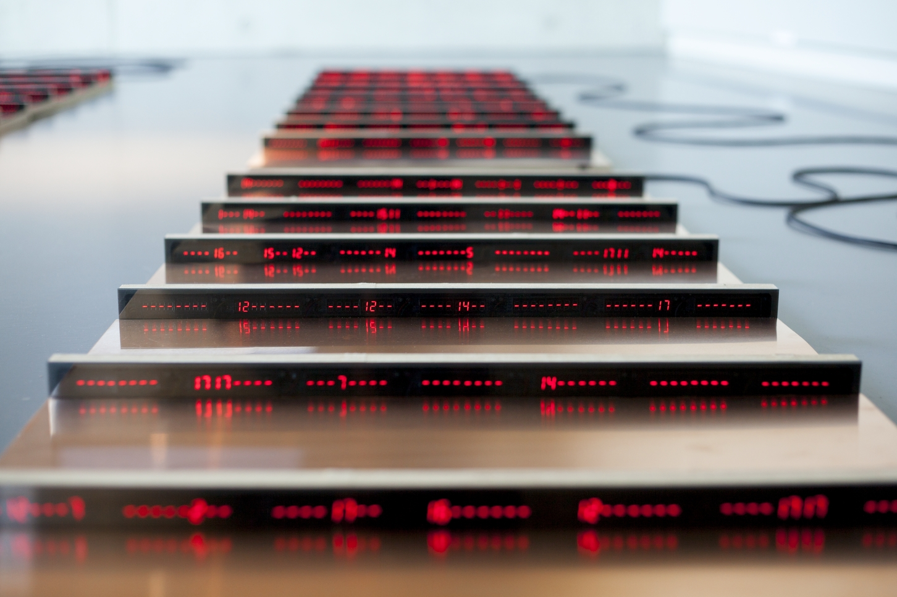
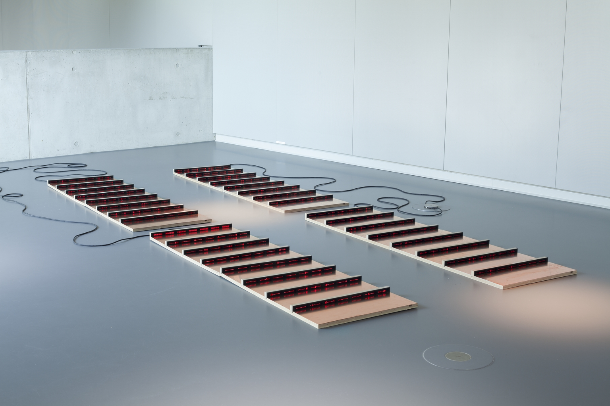
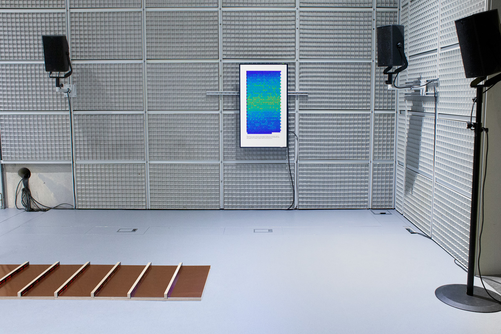
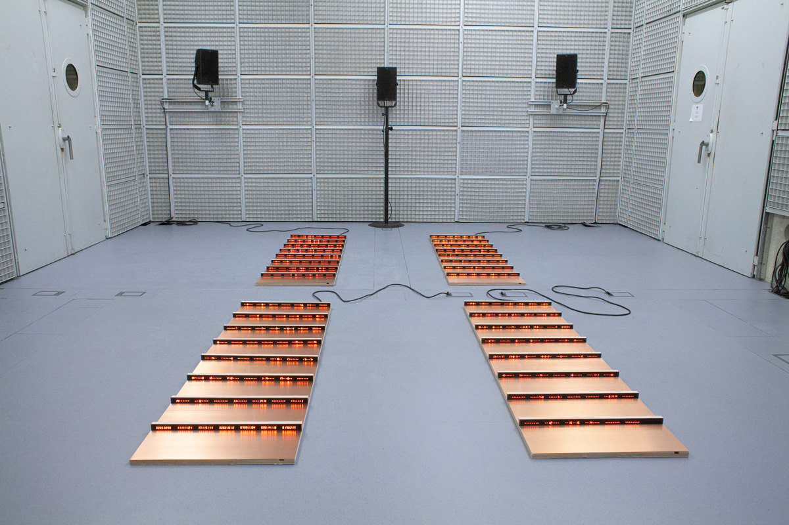
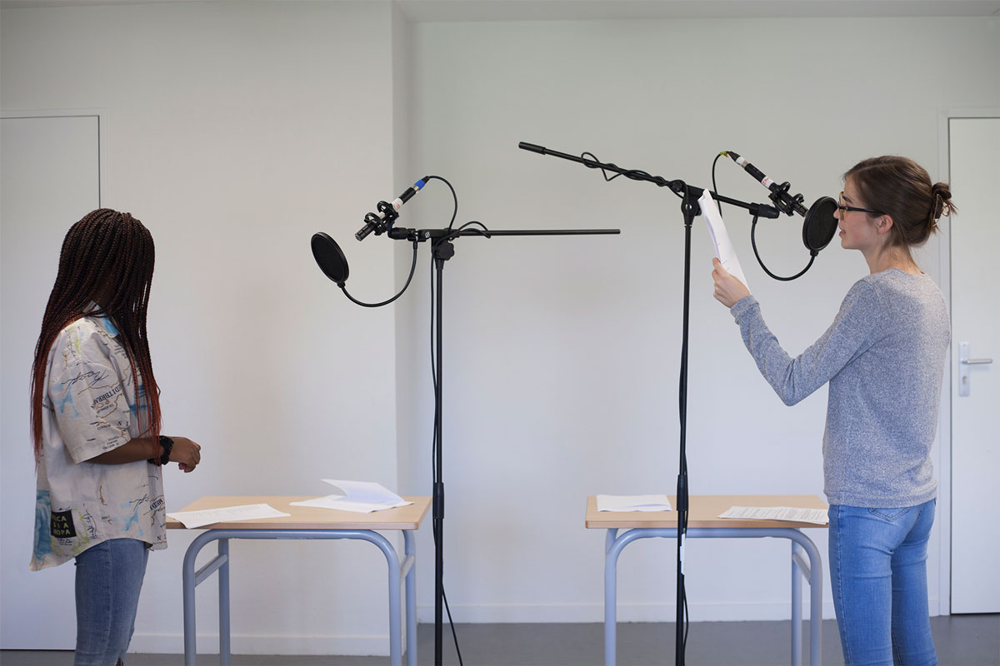
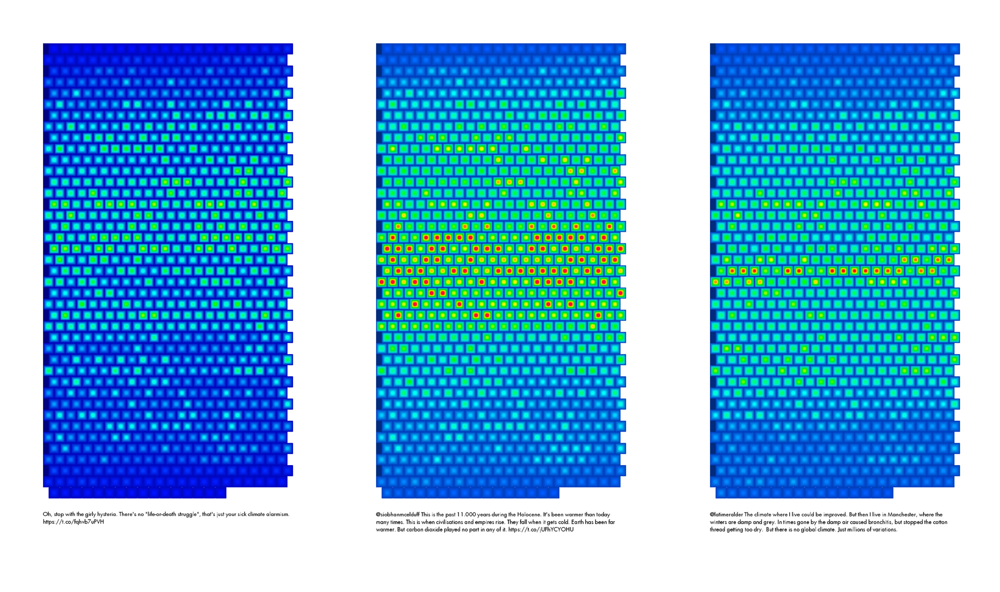
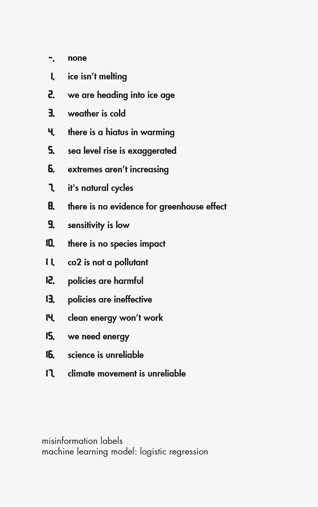

[main](README.md)

**news**

Critical Climate Machine (CCM) has won the BCS Futures Award from the [Lumen Prize](https://www.lumenprize.com) 2023, award for art and technology.

CCM has been nominated for the [S+T+Arts prize 2023](https://starts-prize.aec.at/en).

----------

Critical Climate Machine, exhibition at Deutsches Museum (Das Zukunftsmuseum), Nürnberg, 2021.

----------

Critical Climate Machine, exhibition at Ircam Centre Pompidou, Paris, 2022.

----------

Critical Climate Machine, voice recording with Laëtitia Ngha from Lycée International de l'Est Parisien and Anastasiya Balan from Université Gustave Eiffel, 2021.

----------

*Patterns of Heat*, visualization, Processing code, 2021-2024. Each point represents one of the analysed tweets.

----------

**Project**

Critical Climate Machine (2021-2024) is a research based project that quantifies and reveals the mechanisms of misinformation on global warming. The project environment consists of a walk-in room with a data sculpture and a sound installation, resulting from participatory work. The research draws on cognitive sciences, which have shown – much like inoculation in biology, that disinformation can be neutralized by exposing the public to a weak form of disinformation.

Using natural language processing, the sculpture analyzes myths about climate change. Its software continuously processes false arguments collected from Twitter. As a result the sculpture becomes a landscape of "error codes", which the audience is invited to map using a list of misleading claims. On a vertical screen, a visualization renders the thermal effects of the process on the hardware (Patterns of Heat).

Constructed dialogues surround the sculpture. False arguments are voiced by a speech entity. A second one refutes these claims in response. The composition is based on six voices which were recorded during workshops with students about climate change. Participants were introduced to The Refutation Game – a card game especially designed, based on systematic refutations of skeptical arguments.

A part of the dialogue is reinterpreted through a generative process of musical improvisation grounded in latest research in music and generative machine learning. The chanted terms circulate in space, spatialized on eight sources. If via cognitive sciences, computational logic helps to discern the truth, the sound piece leads to the exploration of new digital mediation frameworks for the climate.

Echoing a philosophy of disautomation, as the philosopher Bernard Stiegler may propose, CCM works as a counterpoint to the determinism of technical automation, while opening up to participatory dimensions and the ethical understanding of data processing. The research extends in more workshops, during exhibitions and in new contexts.

----------

**Credits**

Art and research: Gaëtan Robillard

Voices: Anastasiya Balan, Gabriel Gicquel, Rabiata Issa, Jade Le, Laëtitia Ngha, William Qiu

Musical research: Jérôme Nika;
Sound design: Tony Houziaux;
Computer music: Dionysios Papanikolaou;
Sound production: IRCAM Centre Pompidou

The Refutation Game: Gaëtan Robillard, Laurine Capdeville;
Art consultancy, workshops: Özlem Sulak;
Participants to the first series of workshops: Anastasiya Balan, Lou-Roch Bonnin, Ludwig Chieng, Gabriel Gicquel, Rabiata Issa, Jade Le, Nicolas Lienart, Laëtitia Ngha, Monica Lisacek, Alexia Poncet, Robin Ploix, William Qiu, Simon Roussière, Alexandre Sirey, pupils from Lycée International de l'Est Parisien (international boarding high school of Paris) and students from Gustave Eiffel University

Machine Learning algorithm, training set: John Cook, Travis Coan, Constantine Boussalis, Mirjam O. Nanko;
Deep learning expertise: Vincent Nozick;
Engineering and design: Laurine Capdeville, Jolan Goulin;
Equipment: Laboratoire des Intuitions, ESAD TALM-Tours

**Support received from**

Critical Climate Machine is part of the MediaFutures project, and has received funding from the European Union’s framework Horizon 2020 for research and innovation program under grant agreement No 951962.

As part of CCM, Patterns of Heat is an artistic research conducted in the framework of the intelligent.museum project at the ZKM, Center for Art and Media Karlsruhe and at the Deutsches Museum.

[main](README.md)