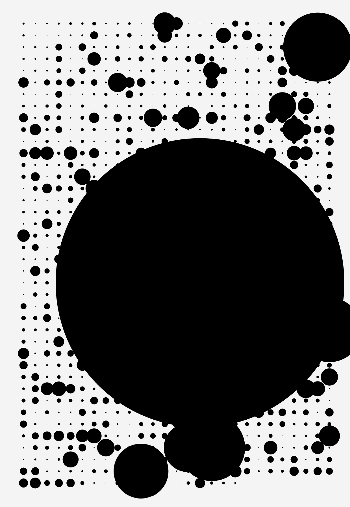
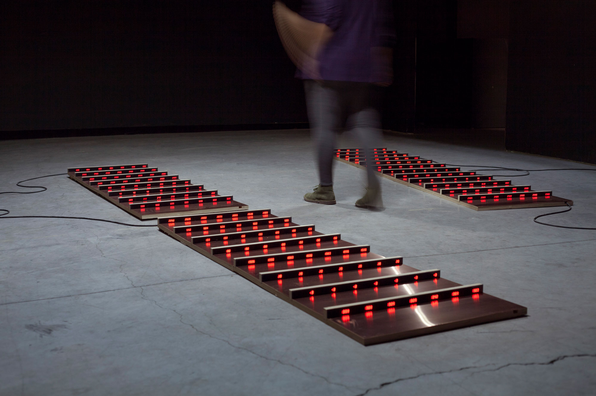
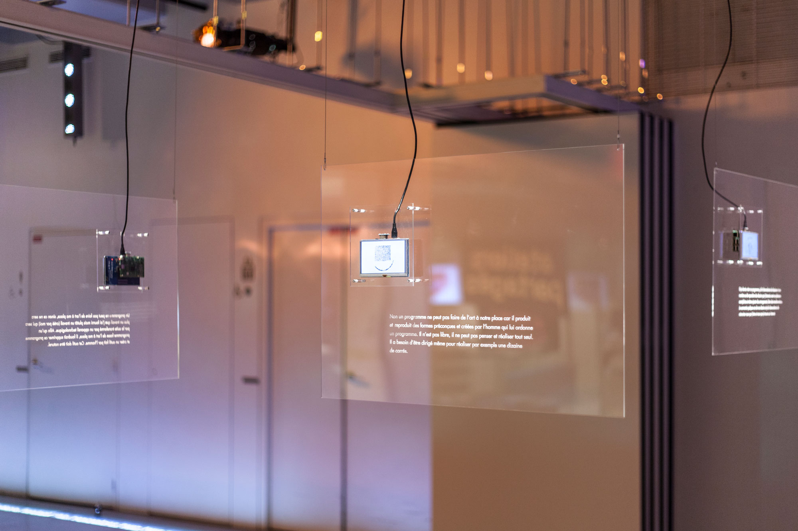

[main](README.md)

[Critical Climate Machine (CCM), 2021-2024](ccm.md)  
[The Refutation Game, 2021](rg.md)  
Climategate: 1073 emails hacked from the Climate Research Unit, 2020  
The Wave in the Matrix, 2019  
The Material Basis, 2019  
Logical Drawings, 2019  
Vera Molnar Machine Visuelle (VMMV), 2018  
Cellular Automata (wall drawing), 2018  
Generic Images (index, generate, learn), 2016  
Undoing the Tide, 2015  
Searching for the Wave, 2013  
Monsieur Tas, 2013  
Citypods, 2007  
Trestles, 2005

----

*Climategate: 1073 emails hacked from the Climate Research Unit*, Processing code, 2020. Visualization of each email according to its length ; largest circle refers to an email containing simulation code. Data source: "Climatic Research Unit emails, data, models, 1996-2009", WikiLeaks, 2009.

----

*The Wave in the Matrix*, wood, copper, electronics, Python software, loop: 12', 2019. Support – AIRLab residency, Partners – LAMAV Laboratory, Paul Painlevé University Lille 1, LETG IUEM, France Energies Marine. Exhibition view at Espace Croisé, Roubaix (solo show), 2019.

----

*Logical Drawings*, six suspended plexiglass sheets, laser engraving, 71x51 cm each, Raspberry Pi microprocessor, 5'' TFT screens, Processing software, 2019. Exhibition view at Gaîté Lyrique (Ateliers partagés), Paris, 2019.

----

*Searching for the Wave (En recherchant la vague)*, audiovisual installation including CNC milling on styrofoam, 2013. Exhibition view at Palais de Tokyo (Le Rêve des formes), 2015.

[main](README.md)
