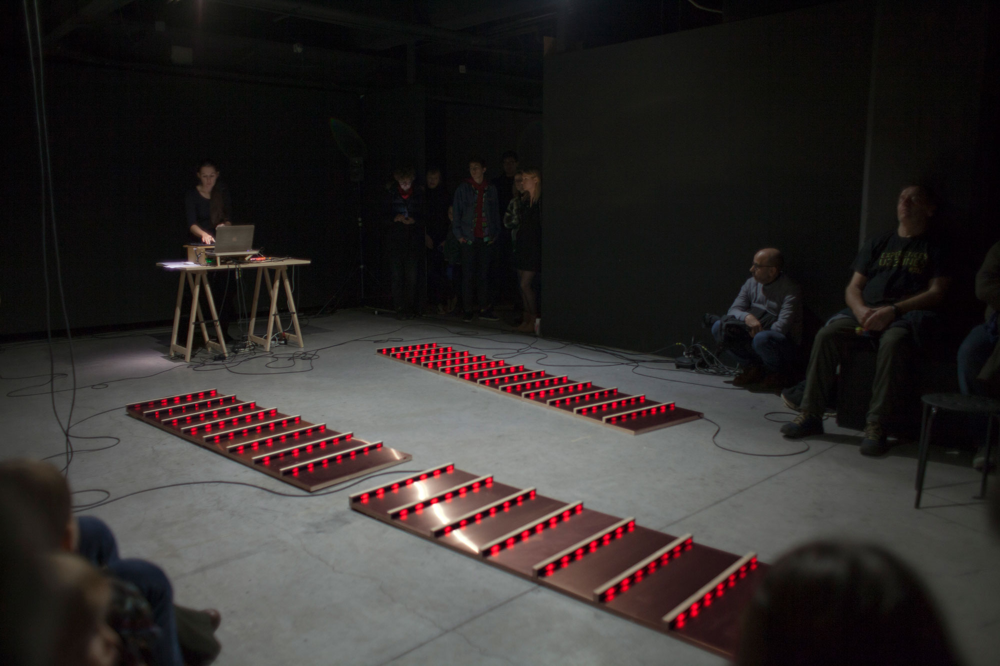

[Critical Climate Machine (CCM), 2021-2024](ccm.md)  
[The Refutation Game, 2021](rg.md)  
Climategate: 1073 emails hacked from the Climate Research Unit institute (UK), 2020  
The Wave in the Matrix, 2019  
The Material Basis, 2019
Logical Drawings, 2019  
Vera Molnar Machine Visuelle (VMMV), 2018  
Cellular Automata (wall drawing), 2018  
Generic Images (index, generate, learn), 2016  
Undoing the Tide, 2015  
Searching for the Wave, 2013  
Monsieur Tas, 2013  
Citypods, 2007  
Trestles, 2005

----

Climategate: 1073 emails hacked from the Climate Research Unit institute (UK), 2020.

Lorem ipsum

Lorem ipsum

Lorem ipsum

Searching for the Wave (En recherchant la vague), audiovisual installation including CNC milling on styrofoam, 2013. Exhibition view at Palais de Tokyo (Le Rêve des formes), 2015.

[Back](README.md)
