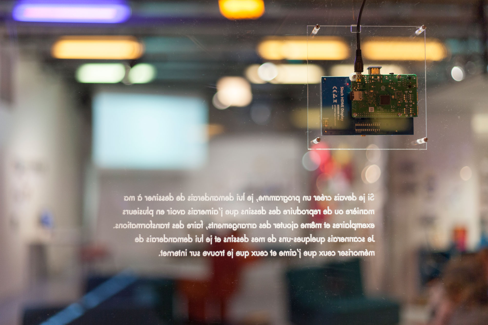
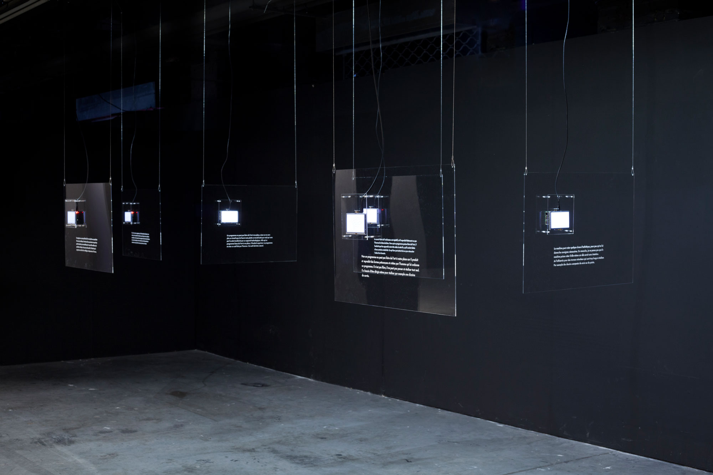
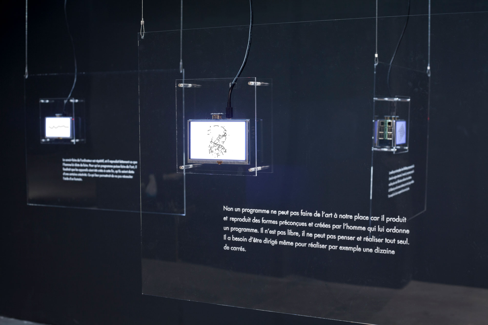
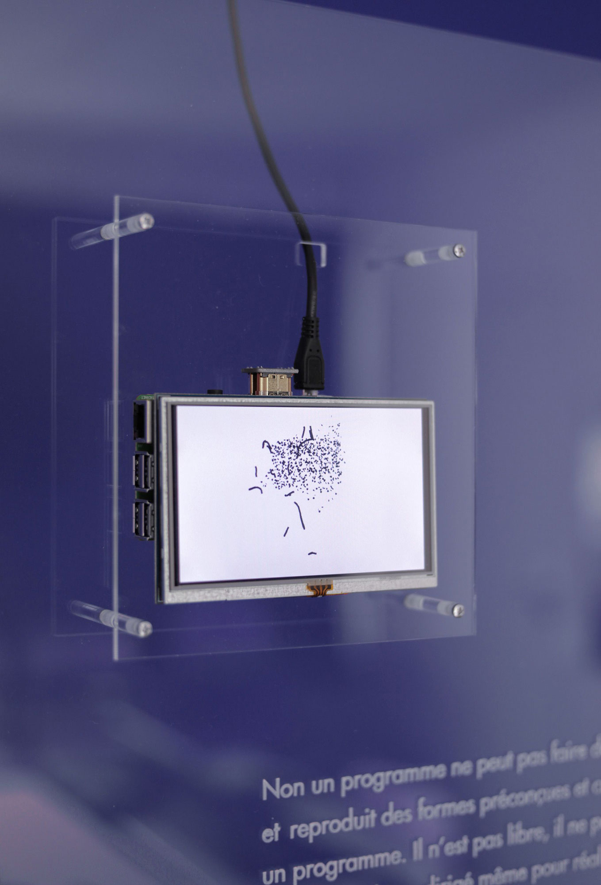

[main](README.md)

*Logical Drawings*, six suspended plexiglass sheets, laser engraving, 71x51 cm each, Raspberry Pi microprocessor, 5'' TFT screens, Processing software, 2019. Exhibition view at Gaîté Lyrique (Ateliers partagés), Paris, 2019.

----

*Logical Drawings*, exhibition view at Espace Croisé (Back / Forward #2), 2019.

----

*Logical Drawings*, detail.

----

If transitioning from drawing on paper to drawing on a screen is now considered obvious, what then about creating a generative program that can perform the graphing of specific elements of representation? "Logical Drawings" is a series that explores this question, addressing both the aspects of programming and spatialization. The evolving drawings displayed on each screen illustrate different types of exercises. Complementing this, texts written by high school students about programmed art provide a contrasting perspective: the views expressed in these texts not only diverge from the ostensibly positive nature of the drawings but also vary among themselves. Within this context, the installation offers an experience where the meanings derived from drawing, writing, and programming intersect and interact.

*S’il est évident de passer du dessin sur papier au dessin sur ecran, qu’en est-il de concevoir un programme génératif qui s’exercerait à la graphie d’un tel ou tel élément de représentation ? Dessins Logiques est une installation qui poursuit cette question à la fois sur le plan de la programmation mais aussi par la conception d’un espace. Les dessins qui évoluent décrivent des situations de transmission. Des textes ecrits par des lycéens sur l’art programmé offrent un contrepoint : les opinions présentés par ces textes divergent du sens positif du programme et divergent également entre eux. En tant qu’environnement, l’installation propose une transaction de sens entre dessin, ecriture et programme.*

For further detail, please refer to Gaëtan Robillard and Alain Lioret, "Generic Images (index, generate, learn): A Heteromatic Environment?", In GA2018, Domus Argenia, 2018.

[main](README.md)