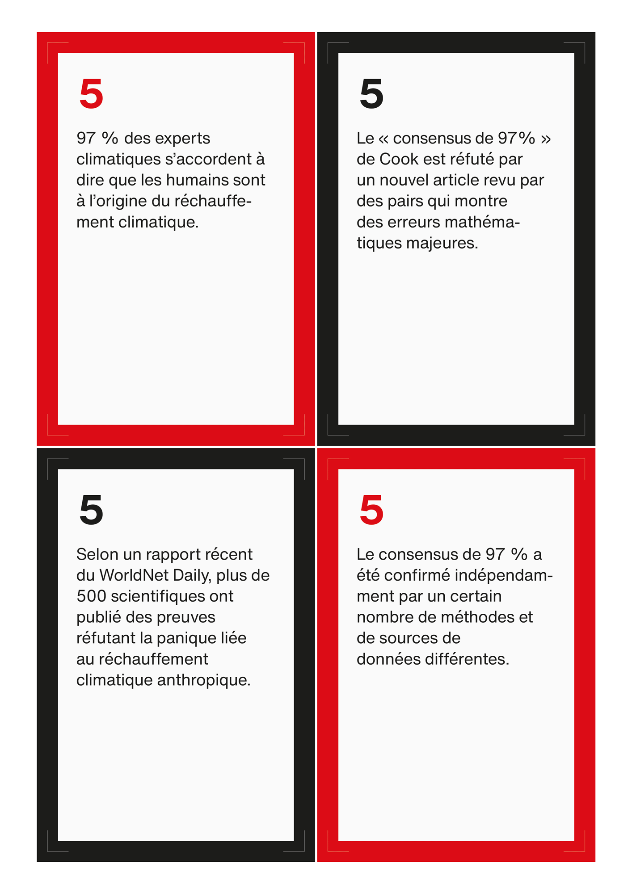
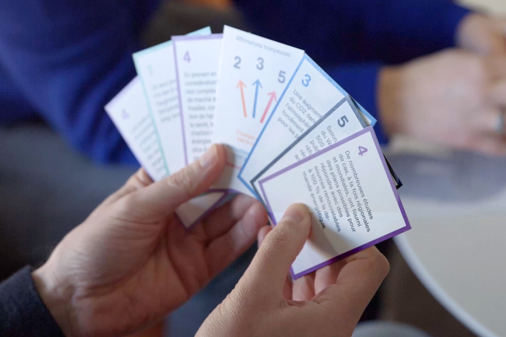
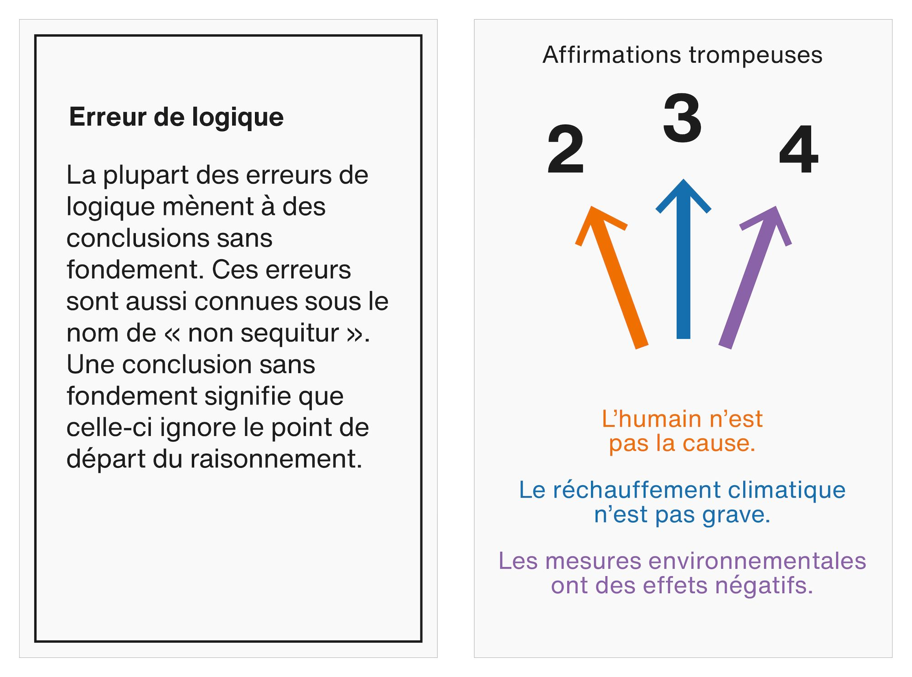

[main](README.md)

Gaëtan Robillard et Laurine Capdeville, Jeu de la réfutation, 2021. Édition française conçue avec le soutien de l'Ircam Centre Pompidou.

Le Jeu de la réfutation est un jeu de soixante-dix cartes qui permet aux joueurs d'identifier et de réfuter les informations trompeuses sur le climat sur un mode délibératif. Tout en s'appuyant sur des données scientifiques, les cartes ont été créées à partir de réfutations systématiques d’arguments sceptiques sur le réchauffement climatique. Le jeu facilite un débat structuré entre les participants.

Le jeu repose sur trois buts importants :

1. identifier les informations trompeuses
2. chercher et une réfutation adaptée
3. comprendre les techniques de désinformation les plus courantes.

Les règles reprennent celles du jeu du Uno. Chaque joueur dispose d’une main de cinq ou sept cartes (selon les variantes) dont il faut se défaire. Les cartes se composent principalement de cartes de désinformations, encadrées en noir, et numérotées selon les cinq grandes catégories de déni (voir plus bas), et des cartes de réfutations encadrées en couleur, avec numérotation correspondante.

Lorsqu’une carte de désinformation est posée, le joueur suivant cherche dans sa main la réfutation la plus pertinente. Les joueurs délibèrent ensuite de la validité de la réfutation proposée.

Les sources du jeu reposent sur un ensemble d’arguments sceptiques extraits d'observations sur des lobbies conservateurs américains, et de réfutations tirées du blog Skeptical Science, une plateforme de debunking éditorialisée pour aider les scientifiques, les journalistes et le grand public à mieux comprendre la désinformation sur le réchauffement climatique.

Les 5 grandes formes de déni (Travis G. Coan et al., 2021) :

1. il n’y a pas de réchauffement climatique
2. ce n’est pas nous
3. ce n’est pas grave
4. les solutions n’y feront rien
5. la science n’est pas fiable

<!--  -->

Soutien

Mediafutures (UE, Horizon 2020), Ircam Centre Pompidou.

Sources

Global Warming and Climate Change skepticism examined, Skeptical Science. Adresse : https://skepticalscience.com/.

Travis G. Coan et al., « Computer-assisted classification of contrarian claims about climate change », Nature Scientific Reports, 2021. Adresse : https://doi.org/10.1038/s41598-021-01714-4.

[main](README.md)

